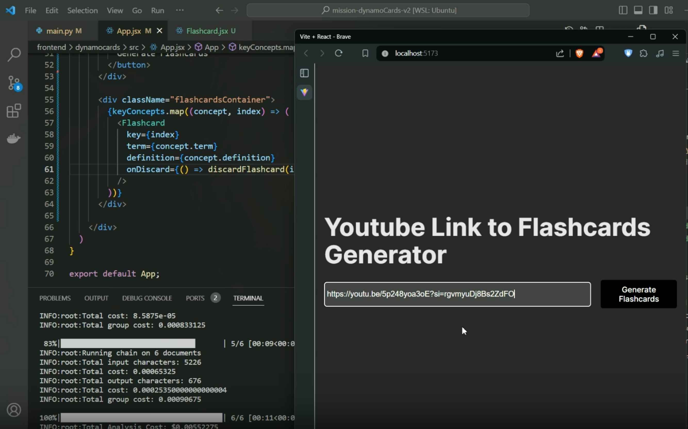
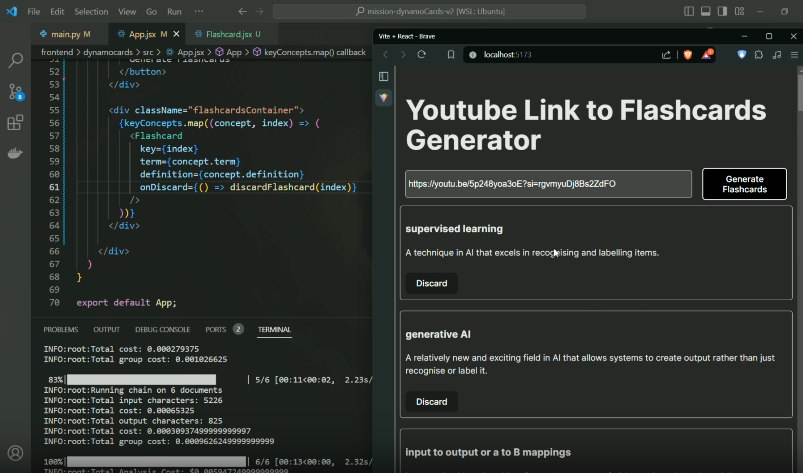
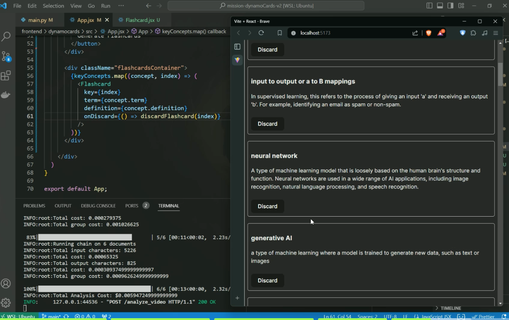
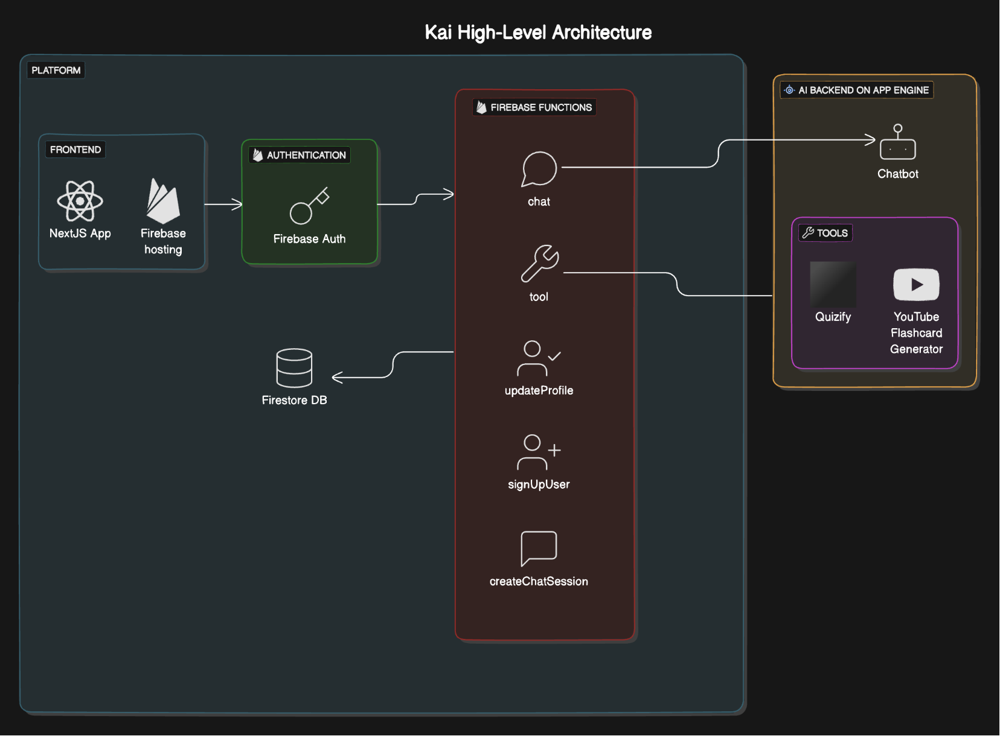

# Gemini Dynamo

Link: https://kai.radicalai.app/

## Project Overview

Gemini Dynamo is one of the two products of Kai. Another product called Quizzify helps to generate cards from a PDF file. For Dynamo, we focus on extracting contents from a YouTube video.

Gemini Dynamo is a backend service designed to assist with studying by generating flashcards from YouTube video transcripts. By simply pasting a YouTube link on the frontend, the software analyzes the video content and extracts key concepts, which are then converted into flashcards for easy studying and review. Rather than spending hours watching a video lecture, the user can easily understand the video by looking at the generated flashcards.

### Generated Flashcards

The link is from Stanford University's Machine Learning course.





### Architecture of Kai AI

We focus on one aspect of Kai in this project.



## Problem the Software Solves

In the age of digital learning, YouTube has become a valuable resource for educational content. However, extracting key information and organizing it for study purposes can be time-consuming and inefficient. Gemini Dynamo addresses this issue by automating the process of generating study flashcards from YouTube videos, allowing users to focus on learning and retention rather than manually creating study aids.

## Tech Stack on the Backend

- **Framework**: FastAPI
- **Language**: Python
- **Environment Management**: Virtualenv
- **AI Models**: Google Vertex AI

## Libraries Used

- **FastAPI**: For creating the web application and API endpoints.
- **Pydantic**: For data validation and settings management.
- **Langchain**: For managing document loading and text splitting.
- **Google Vertex AI**: For leveraging generative AI models.
- **Tqdm**: For creating progress bars in the console.
- **Logging**: For logging information and debugging.

## Technical Details

### How the Code Works Together

#### FastAPI Application Setup (`main.py`)

1. **Imports and Initial Setup**:
    - The code starts by importing necessary modules and classes such as `FastAPI`, `BaseModel`, `HttpUrl`, and `CORSMiddleware`.
    - The `YoutubeProcessor` and `GeminiProcessor` classes from `services.genai` are also imported.

2. **Data Model**:
    - A Pydantic model `VideoAnalysisRequest` is defined to validate incoming requests that must contain a valid YouTube link.

3. **FastAPI Application Initialization**:
    - An instance of `FastAPI` is created.
    - CORS middleware is added to allow requests from any origin.

4. **GeminiProcessor Initialization**:
    - An instance of `GeminiProcessor` is created with specific model parameters.

5. **Endpoint Definition**:
    - A POST endpoint `/analyze_video` is defined which accepts a `VideoAnalysisRequest`.

#### Video Analysis Process (`main.py` and `genai.py`)

1. **Request Handling**:
    - When a POST request is made to `/analyze_video`, the `analyze_video` function is invoked.
    - The YouTube link from the request is passed to a `YoutubeProcessor` instance.

2. **YoutubeProcessor**:
    - The `YoutubeProcessor` retrieves the video transcript using `YoutubeLoader` from `langchain_community.document_loaders`.
    - The transcript is split into manageable chunks using `RecursiveCharacterTextSplitter`.

3. **Processing and Concept Extraction**:
    - The processed chunks are then analyzed by `GeminiProcessor` to retrieve key concepts.
    - `GeminiProcessor` utilizes Google Vertex AI for generating document summaries and extracting concepts.

4. **Response Construction**:
    - The key concepts are processed and formatted into a list of flashcards.
    - The flashcards are returned as a JSON response.

#### Classes and Methods

- **GeminiProcessor**:
    - Handles interactions with Google Vertex AI.
    - Methods include generating document summaries and counting total billable characters.

- **YoutubeProcessor**:
    - Handles loading and processing YouTube video transcripts.
    - Methods include retrieving transcripts and finding key concepts within the documents.

### Key Methods and Their Roles

- **`retrieve_youtube_documents`**:
    - Loads and splits YouTube video transcripts into smaller chunks for processing.

- **`find_key_concepts`**:
    - Analyzes chunks of text to extract key concepts and their definitions using AI models.

- **`generate_document_summary`**:
    - Generates summaries of documents to assist in concept extraction.

## Installation

1. **Clone the repository:**

    ```bash
    git clone https://github.com/richiectr360/mission-dynamoCards
    cd backend
    ```

2. **Create and activate a virtual environment:**

    ```bash
    python3 -m venv env
    source env/bin/activate   # On Windows use `env\Scripts\activate`
    ```

3. **Install the required dependencies:**

    ```bash
    pip install -r requirements.txt
    ```

## Usage

1. **Navigate to the `services` directory:**

    ```bash
    cd services
    ```

2. **Run the FastAPI application:**

    ```bash
    uvicorn main:app --reload
    ```

3. **Open your browser and navigate to** `http://127.0.0.1:8000/docs` **to access the interactive API documentation.**

4. **Send a POST request to analyze a YouTube video:**

    Endpoint: `/analyze_video`
    
    Request Body:
    ```json
    {
        "youtube_link": "https://www.youtube.com/watch?v=example"
    }
    ```

    Example using `curl`:
    ```bash
    curl -X POST "http://127.0.0.1:8000/analyze_video" -H "Content-Type: application/json" -d '{"youtube_link": "https://www.youtube.com/watch?v=example"}'
    ```

## Example

Here is an example of how to use the project:

1. Run the FastAPI application.
2. Send a POST request to the `/analyze_video` endpoint with a YouTube video link.
3. Receive a response containing key concepts extracted from the video's transcript.

## Backend Code Explanation

### `main.py`

The `main.py` file sets up the FastAPI application, configures CORS, and defines the endpoint for video analysis. It uses the `YoutubeProcessor` and `GeminiProcessor` classes from the `genai.py` module to process the YouTube video and extract key concepts.

### `genai.py`

The `genai.py` file contains the `GeminiProcessor` class, which integrates with Google Vertex AI for text summarization and concept extraction, and the `YoutubeProcessor` class, which retrieves and processes YouTube video transcripts.

## Contributing

1. Fork the repository.
2. Create a new branch (`git checkout -b feature-branch`).
3. Make your changes.
4. Commit your changes (`git commit -m 'Add some feature'`).
5. Push to the branch (`git push origin feature-branch`).
6. Open a Pull Request.

## License

This project is licensed under the MIT License - see the [LICENSE](LICENSE) file for details.

## Contact

If you have any questions or feedback, please contact [Richie Singh](mailto:richie.amornchotsingh@gmail.com).
